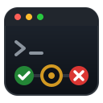

<p align="center">
  
</p>

<h1 align="center">ghtui</h1>

<p align="center">
  A terminal dashboard and CLI for GitHub Actions.<br>
  Watch your pushes, triage failures and operate workflows without leaving the terminal.
</p>

<p align="center">
  <a href="https://github.com/rnjn/ghtui/actions/workflows/ci.yml"></a>
</p>

```text
 ghtui ▸ Runs · rnjn/ghtui                                                                22:24
 4 runs · 0 active · 50% success of 4 finished · median 1m37s
 last failure 23m ago · 0 watched · default branch main
────────────────────────────────────────────────────────────────────────────────────────────────
  STATUS       W  WORKFLOW  BRANCH  EVENT              ACTOR  DURATION  RUN
› ✓ success       CI        main    push               rnjn   49s       #2
  ✗ failure       Dogfood   main    workflow_dispatch  rnjn   1m37s     #2
  ⊘ cancelled     Dogfood   main    workflow_dispatch  rnjn   3m54s     #1
  ✓ success       CI        main    push               rnjn   52s       #1
 polled 0s ago
```

```text
 ghtui ▸ Pipeline · rnjn/ghtui #2 CI                                                      22:26
 ✓ success · main · push · rnjn · 49s
 jobs 3/3 done · 0 failed
────────────────────────────────────────────────────────────────────────────────────────────────
     JOB    DURATION                   │      STEP                          DURATION
› ✓  test   44s                        │   ✓  Set up job                    1s
  ✓  build  21s                        │   ✓  Run actions/checkout@v7       1s
  ✓  lint   19s                        │   ✓  Run actions/setup-go@v7       11s
                                       │   ✓  Test                          26s
                                       │   ✓  Post Run actions/setup-go@v7  0s
                                       │   ✓  Post Run actions/checkout@v7  0s
                                       │   ✓  Complete job                  0s
 polled 0s ago
```

## Features

- **One board for every repo you work on.** Repos you pushed to in the last 14 days, plus pinned ones, with each repo's latest run, running and failed counts.
- **Drill down.** Repositories → Runs → Pipeline (jobs and steps) → Logs, with a header of live stats on every screen.
- **Live step progress and logs.** Running jobs show each step's status and elapsed time; the full log appears the moment the job finishes, with errors and warnings highlighted.
- **Search and fold logs.** `/` to search, `n`/`N` to jump between hits, `z` to fold a step's group.
- **Operate.** Rerun (failed jobs only when any failed), cancel, and dispatch workflows with their inputs, each behind a `y/N` confirmation.
- **Watch a run.** `w` rings the bell and flashes the result when it finishes.
- **Scriptable CLI.** `ghtui list`, `ghtui tail` and `ghtui watch` with exit codes that follow the run's conclusion.
- **Gentle on the API.** ETags, staggered polling, polling only what you look at, automatic slow-down when the rate limit runs low, and a disk cache for instant restarts.

## Install

```sh
go install github.com/rnjn/ghtui/cmd/ghtui@latest
```

Or from a checkout: `make build` writes `bin/ghtui`. Requires Go 1.25+.

## Auth

ghtui uses your GitHub CLI login. It reads a token from `GH_TOKEN`, then
`GITHUB_TOKEN`, then `gh auth token`; if none works, run `gh auth login`.
The token stays in memory. Rerun, cancel and dispatch need write access to
the repository (the `repo` scope `gh auth login` grants is enough).

## The TUI

```sh
ghtui          # Repositories: every repo you pushed to recently
ghtui --here   # straight to the runs of the repo in the current directory
```

| Screen | Shows | Header stats |
|---|---|---|
| Repositories | each repo's latest run, running and failed counts | repos, unavailable, active runs, success rate, failures, watched |
| Runs | a repo's runs: status, workflow, branch, event, actor, duration | runs, active, success rate, median duration, last failure |
| Pipeline | a run's jobs, and the selected job's steps | status, branch, event, actor, duration, jobs done, current step |
| Logs | live steps while a job runs, then its log | job status, steps done, running step, lines, search hits |

| Key | Action |
|---|---|
| `↑`/`k` `↓`/`j` `g` `G` `PgUp` `PgDn` | move or scroll |
| `enter` | open the selected repo, run, job or step |
| `esc` | back (or close a search or filter) |
| `tab` `←` `→` | switch between jobs and steps |
| `/` | search the log (literal, case-insensitive); on Runs, filter by branch or status |
| `n` `N` | next / previous search hit |
| `z` `Z` | fold or unfold the group under the cursor / unfold all |
| `t` | toggle timestamps |
| `w` | watch a run: bell and flash when it finishes |
| `r` | rerun: only failed jobs if any failed, else all (asks `y/N`) |
| `x` | cancel the run (asks `y/N`) |
| `d` | dispatch a workflow: pick one, fill the ref and inputs, confirm `y/N` |
| `o` | open the current repo, run or job in the browser |
| `R` | refresh the current screen now |
| `?` | help |
| `q` | quit |

Actions are fire-and-forget: the status bar says "… requested" and the next
poll shows what GitHub did.

## The CLI

Each command takes `owner/repo` (or `--repo owner/repo`); without it,
the repo comes from the current directory's `origin` remote.

```sh
ghtui list [owner/repo] [--branch B] [--status S] [--limit N] [--json]
```

Recent runs as a table (status, workflow, branch, event, actor, duration,
run number, run ID) or one JSON object per line.

```sh
ghtui tail <run-id|job-id> [--repo owner/repo] [--no-follow] [--timestamps] [--json]
```

Waits for a job and prints its log. A run ID resolves to its only job or its
only running job; otherwise ghtui lists the jobs and asks for a job ID.

```sh
ghtui watch <run-id> [--repo owner/repo] [--interval 5s]
```

Prints one line per run or job status change until the run finishes.

`tail` and `watch` exit 0 on `success`, 1 on any other conclusion, and 2
on usage or API errors, so they work in scripts: `ghtui watch $id && deploy`.

### About live logs

GitHub has no streaming log API, and it publishes a job's log only once the
whole job has finished. While a job runs, ghtui shows each step's status and
elapsed time; the log appears as soon as GitHub publishes it.

## Configuration

Optional, at `~/.config/ghtui/config.yaml`:

```yaml
repos:
  pinned: [owner/repo]       # always on the board
  exclude: [owner/archived]  # never on the board
  pushed_within: 14d         # how recent a push puts a repo on the board
poll:
  runs_active: 15s           # repos with a running or queued run
  runs_idle: 60s
  jobs: 5s                   # the run you are viewing or watching
  logs: 5s                   # ghtui tail
ui:
  show_timestamps: false
```

Repos, runs and ETags are cached in `~/.cache/ghtui/` (or
`$XDG_CACHE_HOME/ghtui/`), so a restart shows the board at once; a broken
cache is ignored. Polling slows ×2 below 500 remaining API requests and ×4
below 100, and the header shows the remaining quota.

## Development

```sh
make test    # go test -race ./...
make lint    # golangci-lint, built into bin/ with your Go toolchain
make build
```

CI runs test, lint and build on every push. The manual
[Dogfood](.github/workflows/dogfood.yml) workflow has timed steps, annotations
and a selectable outcome, for trying ghtui against real runs.

The design lives in [docs/specs](docs/specs/2026-10-07-ghtui-design.md) and
the implementation plans in [docs/plans](docs/plans).
